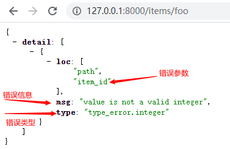

# FastAPI

### 安装
```
pip install -r requirements.txt
```
### 起步
> 1.创建一个FastAPI程序
```
from fastapi import FastAPI #导入FastAPI

app = FastAPI() #创建应用 app 可以自己命名

@app.get('/) #路径操作装饰器
def root(): #路径操作函数
  return {'message':'Hello FastAPI'}

#运行，命令行输入：uvicorn main:app --reload 
#参数说明：main是main.py app 是main.py中定义的应用名  --reload 是服务器重载，修改代码后自动重载
```
> 2.路径操作装饰器,必须跟着路径操作函数
  * @app.get()      -- 查询 select
  * @app.post()     -- 插入 insert
  * @app.put()      -- 修改 update
  * @app.delete()   -- 删除 delete
  * @app.options()
  * @app.head()
  * @app.patch()
  * @app.trace

> 3.路径操作函数，支持异步 函数开头使用async ,函数体使用await
  ```
  async def root():
    await...
  ```

### 路径参数
>1.基本示例
``` 

from fastapi import FastAPI

app = FastAPI()

# item_id是路径参数，是个变量，必须使用{}包裹。请求完整路径:http://127.0.0.1:8000/items/foo,其中foo是参数
@app.get('/items/{item_id}')
async def read_item(item_id):  # item_id必须与路径参数一致
    return {'item_id': item_id}

```
> 2.路径参数带类型
```
from fastapi import FastAPI

app = FastAPI()


# item_id是路径参数，是个变量，必须使用{}包裹。请求完整路径:http://127.0.0.1:8000/items/foo,其中foo是参数
@app.get('/items/{item_id}')
# async def read_item(item_id):  # item_id必须与路径参数一致
#     return {'item_id': item_id}
async def read_item(item_id: int):  # 路径参数带有类型
    return {'item_id': item_id}

```
>3.路径参数类型错误提示，
foo是string类型,item_id要求int;
隐式转换：http://127.0.0.1/items/3，这里不报错，3本身传入也是string类型，但是被自动转换成int类型


>4.路径顺序,小心路径被覆盖
```
'''
/users/me 必须在/users/{user_id} 前面，
  因为代码是顺序执行，放在后面/users/me 就被覆盖了
  me 会当成 user_id传进去，匹配read_user这个函数
''' 
@app.get('/users/me')
async def read_user_me():
    return{"user_id": 'the current_user'}


@app.get('/users/{user_id}')
async def read_user(user_id: str):
    return{"user_id": user_id}

```
>5.枚举类型的路径参数
```
'''
定义模型类，
API 文档将能够知道这些值必须为 string 类型并且能够正确地展示出来
然后创建具有固定值的类属性，这些固定值将是可用的有效值：
'''
class ModelName(str, Enum): #创建一个继承自 str 和 Enum 的子类。通过从 str 继承，
    alexnet = "alexnet"
    resnet = "resnet"
    lenet = "lenet"


@app.get("/models/{model_name}")
async def get_model(model_name: ModelName): #类型标注为ModelName类型,而且传入的参数必须是枚举类中的值，其他值都无效
    if model_name == ModelName.alexnet:
        #model_name.alexnet.value 获取枚举类型的值
        return{"model_name": model_name, "message": "Deep Learning FTW"}

    if model_name == ModelName.lenet:
        return{"model_name": model_name, "message": "leCNN all the images"}
    return {"model_name": model_name, "message": "Have some residuals"}

```
>6.路径参数中含有路径
```
'''
路径参数包含路径，如/files/{file_path},file_path='home/johndoe/myfile.txt'
必须使用file_path:path，:path说明应该匹配路径，测试后发现也可以匹配字符串
'''
@app.get('/files/{file_path:path}')
async def read_file(file_path: str):
    return {'file_path': file_path}

```
### 查询参数
>1.基本示例
```
from fastapi import FastAPI

app = FastAPI()

# 定义临时数据
fake_items_db = [
    {"item_name": 'Foo'},
    {"item_name": 'Bar'},
    {"item_name": 'Baz'},
]

# 请求路径：http://127.0.0.1:8000/items/?skip=2&limit=2
@app.get('/items/')
# 定义参数skip int类型,默认值0,limit:int类型，默认值10
async def read_item(skip: int = 0, limit: int = 10):
    return fake_items_db[skip:skip+limit]  # 数据切片
```
>2.默认值
  ```
  skip,limit都有默认值，如果不填则默认使用默认值
  ```
>3.可选参数
```
from typing import Optional #引入可选类型，Optional[X] 相当于 Union[X, None]

@app.get('/items/{item_id}')
async def read_item(item_id: str, q: Optional[str] = None): # item_id 是路径参数，q 是查询参数
    if q:
        return {'item_id': item_id, "q": q}
    return {"item_id": item_id}

```
>4.查询参数类型转换
```
'''请求路径:http://127.0.0.1:8000/items/foo?short=1
其中：short =1,short = True ,short=true,short=on,short =yes 都可以，均被转换为bool类型
''' 
@app.get('/items/{item_id}')
async def read_item(item_id: str, q: Optional[str] = None, short: bool = False): #布尔型，路径中传入的正值均被转为True
    item = {'item_id': item_id}
    if q:
        item.update({'q': q})
    if not short:
        item.update({'description': '描述信息'})
    return item
```
>5.多路径中的查询参数
```

'''
多路径中的查询参数应用，必须在路径操作函数中定义相同名称即可识别
'''
@app.get('/users/{user_id}/items/{item_id}')
async def read_user_item(user_id: int, item_id: str, q: Optional[str] = None, short: bool = False):
    item = {'item_id': item_id, 'owner_id': user_id}
    if q:
        item.update({'q': q})
    if not short:
        item.update({'description': '描述'})
    return item
```

>6.非路径查询参数，必传、默认值、不传
```
'''
非路径查询参数，必须查询参数.needy必须传入值;skip 可以不传默认为0;limit可以不传，没有默认值
'''
@app.get('/items/{item_id}')
async def read_user_item(item_id: str,needy:str,skip:int =0,limit:Optional[int]=None):
    item={'item_id':item_id,'needy':needy,'skip':skip,'limit':limit}
    return item
```
### 请求体
>1.定义 请求体：客户端发给API的数据；响应体：API发送给客户端的数据
    不能用GET 发送请求体，发送数据常见方法：POST
>2.基本示例
```

# 声明数据模型


class Item(BaseModel):
    name: str
    description: Optional[str] = None
    price: float
    tax: Optional[float] = None


app = FastAPI()


@app.post('/items/')
async def create_item(item: Item):  # item为Item模型的数据，必须全部匹配。如果不匹配，则报错
    print(item.name)  # 支持编辑器代码提示和补全
    #函数体内部可以访问传入的模型对象数据的所有属性
    item_dict = item.dict()
    if item.tax:
        price_with_tax = item.price+item.tax
        item_dict.update({'price_with_tax': price_with_tax})
    return item_dict
```
>3.请求体中的路径参数、查询参数
```

'''
请求体中的路径参数、查询参数
'''


@app.post('/items/{item_id}')
async def create_item(item_id: int, item: Item, q: Optional[str] = None):
    # **item.dict()解包，将字典中的k,v 全部输出
    result = {'item_id': item_id, **item.dict()}
    if q:
        result.update({'q': q})
    return result

```
### 查询参数和字符串校验
>1.基本示例 字符串长度校验
```
from typing import Optional
from pydantic import BaseModel

from fastapi import FastAPI, Query

app = FastAPI()

'''
参数校验，使用Query
'''
@app.get('/items/')
# 字符串不为空时，最短3个字符，最长18个字符。regex使用正则表达式
# title 标题名，description：描述, alias 别名，deprecated 弃用函数
async def read_item(q: Optional[str] = Query(None, title="查询字符串", description='描述', alias='itemp-query',deprecated=True,min_lenght=3, max_length=50, regex='^fixedquery$')):
#async def read_item(q: Optional[str] = Query(None, min_lenght=3, max_length=50,regex='^fixedquery$')):#字符串不为空时，最短3个字符，最长18个字符。regex 为正则表达式
#async def read_items(q: str = Query("fixedquery", min_length=3)): # fixedquery为默认值
#async def read_items(q: str = Query(..., min_length=3)):#...为必须值
#async def read_items(q: Optional[List[str]] = Query(None)):#列表，传入多个值，路径为：/items/?q=foo&q=bar，响应体：{"q":"foo","bar"]} 。使用List时，必须使用Query否则会被解析为响应体

    result = {'items': [{'item_id': 'Foo'}, {'item_id': 'Bar'}]}
    if q:
        result.update({'q': q})
    return result
```

### 路径参数和数值校验
>1.